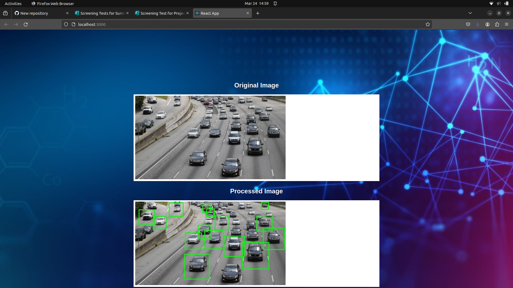

# Vehicle Detection System

This project provides a complete system for vehicle detection, including a frontend application for uploading images and a backend service for processing images and detecting vehicles.

## Features

- Upload an image for vehicle detection.
- Process the uploaded image to detect vehicles and display the result.
- Docker Compose configuration for easy deployment.

## Prerequisites [To run locally]

Before running the application, ensure you have the following installed:

- Node.js
- Python

## Installation

Clone this repository:

```bash
git clone https://github.com/PrithwikaDas/vehicledetection
```

Navigate to the project directory:

```bash
cd vehicledetection
```

### Backend

Navigate to the backend directory:

```bash
cd backend
```

Install the required Python dependencies:

```bash
pip install -r requirements.txt`
```

### Frontend

Navigate to the frontend directory:

```bash
cd ../frontend
```

Install the required npm packages:

```bash
npm install
```

## Usage

### Backend

Start the backend server:

```bash
python app.py
```

The backend server will run on `http://localhost:5000`.

### Frontend

Start the frontend development server:

```bash
npm start
```

Access the frontend application in your web browser at `http://localhost:3000`

Use the file input to upload an image for vehicle detection. Once the image is uploaded, the frontend sends a POST request to the backend for processing. The original image and the processed image with detected vehicles will be displayed side by side.

## Configuration

The backend service is exposed on port 5000, and the frontend service is exposed on port 3000.

## Directory Structure

```lua
<project_directory>/
|-- backend/
|   |-- app.py
|   |-- Dockerfile
|   |-- requirements.txt
|   |-- haarcascade_car.xml
|-- frontend/
|   |-- public/
|   |-- src/
|   |-- Dockerfile
|   |-- package.json
|   |-- README.md
|-- docker-compose.yml
|-- README.md`
```

## Dependencies

### Backend

- Flask
- Flask-CORS
- OpenCV-Python
- NumPy

### Frontend

- React
- CSS

## Note

Ensure Python and Node.js are installed and configured properly on your system before running the backend and frontend respectively.

---

## Prerequisites [To run in Docker]

Before running the application, ensure you have the following installed:

- Docker
- Docker Compose

## Installation

Clone this repository:

```bash
git clone https://github.com/PrithwikaDas/vehicledetection
```

Navigate to the project directory:

```bash
cd vehicledetection
```

Build and run the Docker containers using Docker Compose:

```bash
docker-compose up --build.
```

## **Usage**

Access the frontend application in your web browser at `http://localhost:3000` Use the file input to upload an image for vehicle detection. Once the image is uploaded, the frontend sends a POST request to the backend for processing. The original image and the processed image with detected vehicles will be displayed side by side.

## Configuration

The Docker Compose configuration (docker-compose.yml) defines two services: frontend and backend. They are configured to communicate with each other using a Docker network called my-network.

## Note

Make sure Docker is running on your system before starting the containers.

The backend service is exposed on port `5000`, and the frontend service is exposed on port `3000`. Adjust these ports if necessary in the `docker-compose.yaml` file.

## Demo



